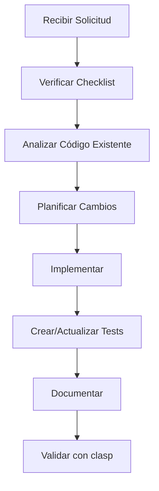
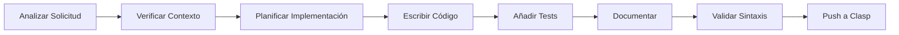

# AGENTS.md - Guía para Agentes de IA

## Descripción General

Este repositorio contiene una plantilla optimizada para proyectos de Google Apps Script administrados con `clasp`, específicamente diseñada para la colaboración eficiente entre desarrolladores humanos y agentes de IA. La estructura y convenciones están pensadas para maximizar la productividad y la calidad del código cuando se trabaja con asistentes de IA.

## Estructura del Proyecto

```
/src/               # Código fuente de Apps Script (.js/.gs)
  ├── main.js       # Función principal y punto de entrada
  ├── utils/        # Funciones utilitarias reutilizables
  ├── services/     # Integraciones con servicios de Google
  └── config/       # Configuraciones y constantes
/tests/             # Pruebas unitarias (Jest + gas-local)
/docs/              # Documentación técnica y API
/lib/               # Bibliotecas compartidas y helpers
/.github/           # Workflows de CI/CD y templates
.clasp.json         # Configuración de clasp
.claspignore        # Archivos a ignorar en el despliegue
appsscript.json     # Manifiesto de Apps Script
```

> **Nota para Agentes IA:** Siempre verifica la existencia de directorios antes de crear archivos. Usa `mkdir -p` para crear directorios padre si es necesario.

## Protocolo de Comunicación con Agentes IA

### 🤖 Comandos Específicos para Agentes

Los agentes de IA deben usar estos prefijos para comunicar su intención claramente:

- `[ANALIZAR]` - Para revisar código existente y sugerir mejoras
- `[CREAR]` - Para generar nuevos archivos o funciones
- `[REFACTOR]` - Para reestructurar código existente
- `[TESTING]` - Para crear o ejecutar pruebas
- `[DEPLOY]` - Para operaciones de despliegue con clasp
- `[DEBUG]` - Para resolver errores o problemas

### 📋 Checklist Pre-Desarrollo

Antes de comenzar cualquier tarea, los agentes deben verificar:

1. ✅ Estructura de directorios existe (`src/`, `tests/`, `docs/`)
2. ✅ Configuración de clasp (`.clasp.json`) está presente
3. ✅ Manifiesto (`appsscript.json`) está configurado
4. ✅ Dependencias en `package.json` están actualizadas
5. ✅ Variables de entorno necesarias definidas

### 🔄 Flujo de Trabajo Recomendado



## Convenciones de Codificación

* **Lenguaje:** JavaScript (ECMAScript 2020) con V8 Runtime
* **Estilo:** Airbnb JavaScript Style Guide
* **Nomenclatura:** CamelCase para variables y funciones; PascalCase para clases
* **Comentarios:** JSDoc para todas las funciones públicas
* **Linter:** ESLint con configuración en `.eslintrc.json`

### 🎯 Patrones de Código para Agentes

```javascript
/**
 * Plantilla estándar para funciones de Apps Script
 * @param {string} parameter - Descripción del parámetro
 * @returns {Object} Descripción del retorno
 */
function templateFunction(parameter) {
  try {
    // Validación de entrada
    if (!parameter) {
      throw new Error('Parameter is required');
    }
    
    // Lógica principal
    const result = processData(parameter);
    
    // Log para debugging
    console.log(`Function executed successfully: ${JSON.stringify(result)}`);
    
    return result;
  } catch (error) {
    console.error(`Error in templateFunction: ${error.message}`);
    throw error;
  }
}
```

## Requisitos de Pruebas

* **Framework:** Jest adaptado para Google Apps Script mediante `gas-local`
* **Cobertura mínima:** 90% de líneas y funciones
* **Estructura de tests:**

```javascript
/**
 * Template para tests de Apps Script
 */
describe('FunctionName Tests', () => {
  beforeEach(() => {
    // Setup común
  });

  test('should handle valid input', () => {
    // Arrange
    const input = 'test data';
    
    // Act
    const result = functionName(input);
    
    // Assert
    expect(result).toBeDefined();
    expect(result.property).toBe('expected value');
  });

  test('should throw error for invalid input', () => {
    // Arrange & Act & Assert
    expect(() => functionName(null)).toThrow('Parameter is required');
  });
});
```

> **Nota:** Los comandos `npm run test` y `npm run coverage` deben configurarse en `package.json`.

## Integraciones y Servicios Avanzados

Este proyecto puede emplear los siguientes servicios avanzados de Google Apps Script:

### 📊 Servicios Principales
* **Sheets API** - Para manipulación avanzada de hojas de cálculo
* **Drive API** - Para gestión de archivos y carpetas
* **Gmail API** - Para envío y gestión de correos electrónicos
* **Calendar API** - Para gestión de eventos y calendarios
* **Docs API** - Para creación y edición de documentos

### 🔧 Configuración de Servicios

```javascript
// Ejemplo de configuración de servicios
const CONFIG = {
  SHEETS: {
    SPREADSHEET_ID: 'your-spreadsheet-id',
    RANGE: 'Sheet1!A1:Z1000'
  },
  GMAIL: {
    FROM_EMAIL: 'noreply@yourdomain.com',
    TEMPLATE_FOLDER: 'Email Templates'
  },
  DRIVE: {
    BACKUP_FOLDER: 'Backups',
    TEMP_FOLDER: 'Temp Files'
  }
};
```

> **Importante:** Asegúrate de habilitar estos servicios en el editor de Apps Script bajo "Servicios Avanzados de Google".

## Directrices Específicas para Agentes de IA

### 🏗️ Arquitectura y Modularidad

* **Separación de responsabilidades:** Cada archivo debe tener una responsabilidad específica
* **Funciones puras:** Priorizar funciones sin efectos secundarios cuando sea posible
* **Manejo de errores:** Implementar try-catch en todas las funciones principales
* **Logging:** Usar console.log/error para debugging en desarrollo

### 📝 Documentación Obligatoria

```javascript
/**
 * Descripción clara y concisa de la función
 * @param {string} param1 - Descripción detallada del parámetro
 * @param {Object} param2 - Objeto con propiedades específicas
 * @param {string} param2.property - Propiedad específica del objeto
 * @returns {Promise<Object>} Descripción del objeto retornado
 * @throws {Error} Cuándo y por qué puede fallar la función
 * @example
 * const result = await myFunction('test', { property: 'value' });
 * console.log(result.data);
 */
```

### 🔒 Seguridad y Mejores Prácticas

* **Credenciales:** Usar PropertiesService para datos sensibles
* **Validación:** Validar todos los inputs del usuario
* **Límites:** Respetar los límites de cuota de Google Apps Script
* **Permisos:** Solicitar solo los permisos mínimos necesarios

```javascript
// Ejemplo de manejo seguro de propiedades
function getSecureProperty(key) {
  const properties = PropertiesService.getScriptProperties();
  const value = properties.getProperty(key);
  
  if (!value) {
    throw new Error(`Property ${key} not found. Configure it in Script Properties.`);
  }
  
  return value;
}
```

## Comandos Clasp Esenciales

### 🚀 Comandos para Agentes

```bash
# Inicialización del proyecto
clasp login                    # Autenticar con Google
clasp create --title "Project Name" --type standalone
clasp pull                     # Descargar código desde Apps Script

# Desarrollo
clasp push                     # Subir cambios locales
clasp push --watch             # Subir cambios automáticamente
clasp open                     # Abrir en editor web

# Despliegue
clasp deploy                   # Crear nueva versión
clasp deploy --description "Version description"
clasp versions                 # Listar versiones

# Debugging
clasp logs                     # Ver logs de ejecución
clasp logs --json              # Logs en formato JSON
```

### ⚙️ Configuración de .clasp.json

```json
{
  "scriptId": "your-script-id",
  "rootDir": "./src",
  "filePushOrder": [
    "config.js",
    "utils.js",
    "main.js"
  ]
}
```

## Configuración de Entorno

### 📋 Variables de Entorno

Crear archivo `.env` (no incluir en git):

```bash
# APIs Keys
GOOGLE_SCRIPT_ID=your_script_id
SPREADSHEET_ID=your_spreadsheet_id

# Email Configuration
FROM_EMAIL=noreply@yourdomain.com
ADMIN_EMAIL=admin@yourdomain.com

# External APIs
THIRD_PARTY_API_KEY=your_api_key
```

### 🔧 Scripts de NPM Recomendados

```json
{
  "scripts": {
    "push": "clasp push",
    "pull": "clasp pull",
    "deploy": "clasp deploy",
    "open": "clasp open",
    "logs": "clasp logs",
    "test": "jest",
    "test:watch": "jest --watch",
    "coverage": "jest --coverage",
    "lint": "eslint src/**/*.js",
    "lint:fix": "eslint src/**/*.js --fix"
  }
}
```

## Solución de Problemas Comunes

### 🐛 Errores Frecuentes

| Error | Causa | Solución |
|-------|-------|----------|
| `ScriptError: Authorization required` | Permisos insuficientes | Revisar `appsscript.json` y añadir scopes necesarios |
| `TypeError: Cannot read property` | Variable undefined | Añadir validación de inputs |
| `Exceeded maximum execution time` | Script muy lento | Optimizar loops y usar batch operations |
| `Service invoked too many times` | Exceso de llamadas API | Implementar caching y rate limiting |

### 📊 Monitoreo y Debugging

```javascript
// Utility para debugging
function debugLog(functionName, data, level = 'INFO') {
  const timestamp = new Date().toISOString();
  const message = `[${timestamp}] [${level}] ${functionName}: ${JSON.stringify(data)}`;
  
  console.log(message);
  
  // Opcional: guardar en Spreadsheet para análisis
  if (level === 'ERROR') {
    logToSpreadsheet(message);
  }
}
```

## Instrucciones Específicas para Agentes de IA

### 🎯 Contexto de Trabajo

**IMPORTANTE:** Como agente de IA trabajando en este proyecto de Google Apps Script, debes seguir estas pautas específicas para garantizar código de alta calidad y compatibilidad:

### 🔧 Análisis Inicial Obligatorio

Antes de realizar cualquier cambio, ejecuta estos pasos:

1. **Verificar estructura existente:**
   ```bash
   ls -la src/
   ls -la .
   ```

2. **Revisar configuración de clasp:**
   ```bash
   cat .clasp.json 2>/dev/null || echo "No .clasp.json found"
   ```

3. **Verificar package.json y dependencias:**
   ```bash
   cat package.json
   npm list --depth=0 2>/dev/null || echo "Dependencies not installed"
   ```

### 📝 Patrones de Implementación Requeridos

#### Para Funciones de Google Sheets:
```javascript
/**
 * Función para manipular Google Sheets
 * @param {string} spreadsheetId - ID de la hoja de cálculo
 * @param {string} range - Rango de celdas (ej: 'A1:Z100')
 * @param {Array} data - Datos a escribir
 * @returns {Object} Resultado de la operación
 */
function updateSheetData(spreadsheetId, range, data) {
  try {
    // Validación de parámetros
    if (!spreadsheetId || !range || !data) {
      throw new Error('Todos los parámetros son requeridos');
    }

    const sheet = SpreadsheetApp.openById(spreadsheetId);
    const targetRange = sheet.getRange(range);
    
    // Operación principal
    targetRange.setValues(data);
    
    // Log para monitoreo
    console.log(`Datos actualizados en ${spreadsheetId}, rango: ${range}`);
    
    return {
      success: true,
      updatedCells: data.length,
      range: range
    };
    
  } catch (error) {
    console.error(`Error en updateSheetData: ${error.message}`);
    throw new Error(`Falló la actualización de datos: ${error.message}`);
  }
}
```

#### Para Funciones de Gmail:
```javascript
/**
 * Función para enviar emails con template
 * @param {Object} emailConfig - Configuración del email
 * @param {string} emailConfig.to - Destinatario
 * @param {string} emailConfig.subject - Asunto
 * @param {string} emailConfig.template - Nombre del template
 * @param {Object} emailConfig.data - Datos para el template
 * @returns {Object} Resultado del envío
 */
function sendTemplatedEmail(emailConfig) {
  try {
    const { to, subject, template, data } = emailConfig;
    
    // Validación
    if (!to || !subject || !template) {
      throw new Error('to, subject y template son requeridos');
    }
    
    // Cargar template
    const templateContent = loadEmailTemplate(template);
    const htmlBody = processTemplate(templateContent, data);
    
    // Enviar email
    GmailApp.sendEmail(to, subject, '', {
      htmlBody: htmlBody,
      name: getSecureProperty('FROM_NAME') || 'Sistema Automatizado'
    });
    
    console.log(`Email enviado a ${to} con template ${template}`);
    
    return {
      success: true,
      recipient: to,
      template: template,
      timestamp: new Date().toISOString()
    };
    
  } catch (error) {
    console.error(`Error en sendTemplatedEmail: ${error.message}`);
    throw error;
  }
}
```

### 🚦 Reglas de Validación

1. **Siempre validar parámetros de entrada**
2. **Usar try-catch en todas las funciones principales**
3. **Implementar logging detallado**
4. **Manejar casos de error gracefully**
5. **Documentar con JSDoc completo**

### 🔄 Workflow de Desarrollo



### 🧪 Testing Obligatorio

Para cada función creada, genera su test correspondiente:

```javascript
// tests/[nombre-funcion].test.js
const { updateSheetData } = require('../src/main.js');

describe('updateSheetData', () => {
  test('debe actualizar datos correctamente', () => {
    const mockData = [['col1', 'col2'], ['val1', 'val2']];
    const result = updateSheetData('test-id', 'A1:B2', mockData);
    
    expect(result.success).toBe(true);
    expect(result.updatedCells).toBe(2);
  });
  
  test('debe fallar con parámetros inválidos', () => {
    expect(() => updateSheetData(null, 'A1:B1', [])).toThrow();
  });
});
```

### 📋 Checklist de Calidad

Antes de completar cualquier tarea, verifica:

- [ ] ✅ Función documentada con JSDoc completo
- [ ] ✅ Manejo de errores implementado
- [ ] ✅ Validación de parámetros añadida
- [ ] ✅ Logging apropiado incluido
- [ ] ✅ Test unitario creado
- [ ] ✅ Sintaxis verificada
- [ ] ✅ Seguimiento de convenciones de nomenclatura

### 🚨 Errores Comunes a Evitar

1. **No validar parámetros:** Siempre verificar que los inputs sean válidos
2. **Asumir existencia de archivos:** Verificar que los recursos existan antes de usarlos
3. **Ignorar límites de API:** Respetar cuotas de Google Apps Script
4. **Hardcodear valores:** Usar configuración y variables de entorno
5. **No manejar errores:** Implementar try-catch apropiadamente

### 🔍 Debugging y Monitoreo

Usa estas funciones helper para debugging:

```javascript
// src/utils/debug.js
function createDebugger(moduleName) {
  return {
    log: (message, data = null) => {
      const timestamp = new Date().toISOString();
      const logData = data ? ` | Data: ${JSON.stringify(data)}` : '';
      console.log(`[${timestamp}] [${moduleName}] ${message}${logData}`);
    },
    
    error: (message, error = null) => {
      const timestamp = new Date().toISOString();
      const errorData = error ? ` | Error: ${error.message}` : '';
      console.error(`[${timestamp}] [ERROR] [${moduleName}] ${message}${errorData}`);
    }
  };
}

// Uso en tus funciones
const debug = createDebugger('SheetOperations');
debug.log('Iniciando actualización de datos', { range: 'A1:B10' });
```

---
