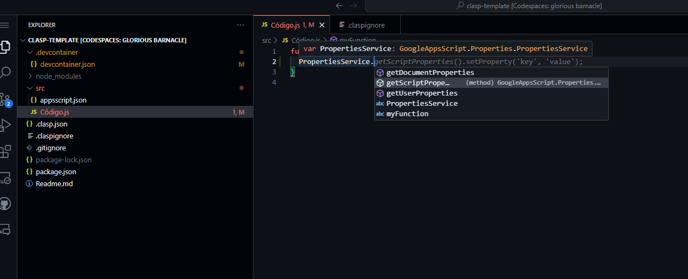

##

[](https://github.com/google/clasp)

## How to create this
use this tutorial https://www.youtube.com/watch?v=4Qlt3p6N0es&ab_channel=LearnGoogleSpreadsheets
```
npm install -g @google/clasp
```

```
 clasp login
```
```
 npm init
```

create src directory and clone your script

```
mkdir src
```
Autocomplete with vscode 
```
npm i -S @types/google-apps-script   
```

Primero ingrese a la carpeta src, que es donde se va a alojar su proyecto de Clasp

```
 clasp clone "SCRIPT-ID" --rootDir .
 ```

> Cuando lo clona el no trackeara el archivo .claspignore, pero omitira los archivos definidos en este archivo.

 Para verificar los archivos de un proyecto existente use:
 ```
 clasp status
 ```

 ## How to use 

 

- clasp push
- clasp pull
- **Push changes on save in your directory**
    ```
    clasp push -w
    ```

## Features

- Autocomplete for classes of Google Apps Script in VSCode
